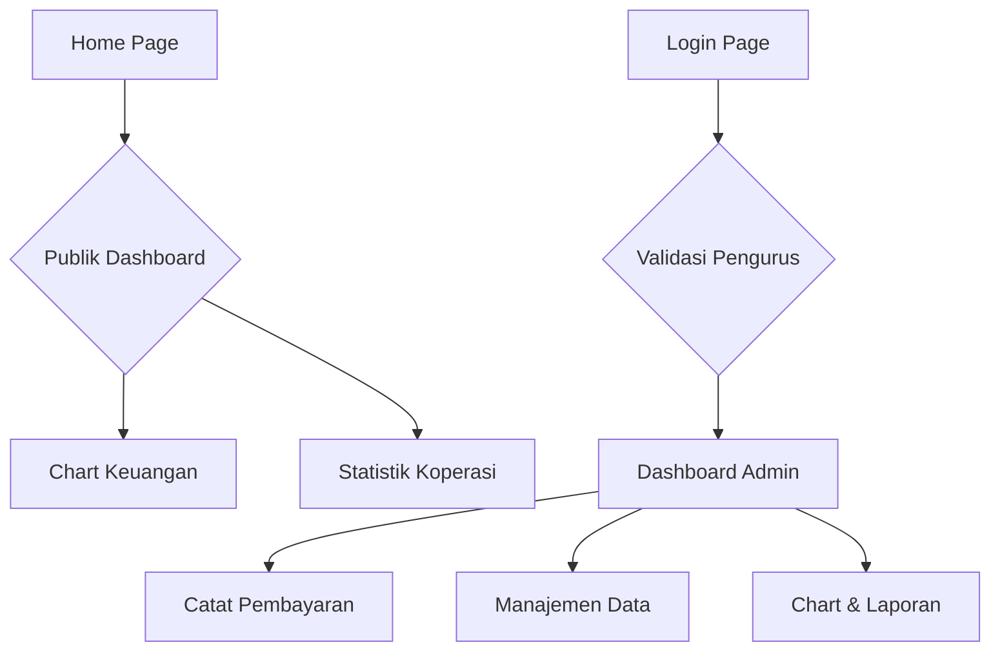

## 1. Product Overview

Aplikasi koperasi digital yang memudahkan pengelolaan data anggota, pinjaman, saldo, dan pembayaran. Aplikasi ini membantu pengurus koperasi untuk memantau kinerja keuangan secara real-time dan memberikan kemudahan bagi masyarakat untuk melihat informasi keuangan koperasi secara transparan.

Target pengguna adalah koperasi-koperasi kecil hingga menengah yang membutuhkan sistem terpadu untuk mengelola keuangan dan data anggota secara efisien, dengan transparansi informasi keuangan untuk publik.

## 2. Core Features

### 2.1 User Roles

| Role     | Registration Method               | Core Permissions                                                                   |
| -------- | --------------------------------- | ---------------------------------------------------------------------------------- |
| Publik   | Tidak perlu login                 | Melihat dashboard keuangan koperasi secara umum (chart, total saldo, statistik)    |
| Anggota  | Registrasi melalui admin/pengurus | Melihat dashboard dengan data pribadi, saldo, riwayat pinjaman dan pembayaran      |
| Pengurus | Registrasi oleh super admin       | Akses penuh dashboard, manajemen anggota, pinjaman, saldo, pembayaran, dan laporan |

### 2.2 Feature Module

Aplikasi koperasi ini terdiri dari halaman-halaman utama berikut:

1. **Home Page**: Dashboard publik yang dapat diakses tanpa login, menampilkan chart keuangan dan statistik koperasi
2. **Login Page**: Form autentikasi khusus untuk pengurus (wajib login untuk mencatat pembayaran)
3. **Dashboard Page**: Informasi lengkap anggota, pinjaman, saldo, pembayaran, dan chart interaktif (untuk pengurus login)

### 2.3 Page Details

| Page Name      | Module Name               | Feature description                                                                                                                                             |
| -------------- | ------------------------- | --------------------------------------------------------------------------------------------------------------------------------------------------------------- |
| Login Page     | Authentication Form       | Masukkan username dan password (khusus pengurus), validasi kredensial, redirect ke dashboard admin untuk mencatat pembayaran                                    |
| Dashboard Page | Member Statistics Card    | Tampilkan jumlah total anggota aktif, jumlah anggota baru bulan ini, persentase pertumbuhan anggota                                                             |
| Dashboard Page | Loan Overview Card        | Tampilkan total pinjaman aktif, jumlah pinjaman baru bulan ini, total pinjaman lunas                                                                            |
| Dashboard Page | Balance Summary Card      | Tampilkan total saldo koperasi, saldo bulan lalu, pertumbuhan saldo dalam persentase                                                                            |
| Dashboard Page | Monthly Payment Tracker   | Tampilkan ringkasan pembayaran bulan ini, jumlah anggota yang sudah membayar, jumlah yang belum membayar, serta status pembayaran infaq dan tabungan            |
| Dashboard Page | Optional Payment Tracker  | Tampilkan status pembayaran infaq dan tabungan per anggota, total infaq dan tabungan bulan ini, daftar anggota yang sudah/belum bayar infaq                     |
| Dashboard Page | Payment Input Form        | Form untuk mencatat pembayaran anggota dengan pilihan jenis: bulanan (wajib), infaq (optional), tabungan (optional), input nominal, tanggal, dan catatan        |
| Dashboard Page | Interactive Balance Chart | Chart garis interaktif menampilkan perubahan saldo dari bulan ke bulan, filter berdasarkan tahun dan bulan, hover untuk detail nilai, export data ke format CSV |
| Home Page      | Quick Summary Widget      | Ringkasan cepat dari data yang sama dengan dashboard dalam bentuk kartu-kartu kecil, termasuk total infaq dan tabungan bulan ini                                |
| Home Page      | Payment Status Widget     | Widget kecil menampilkan status pembayaran bulanan, infaq, dan tabungan pengguna yang sedang login                                                              |
| Home Page      | Navigation Menu           | Akses cepat ke dashboard, profil, pengaturan, dan logout                                                                                                        |

## 3. Core Process

### Flow Publik (Tanpa Login)

1. Pengguna mengakses halaman home secara langsung
2. Melihat dashboard keuangan koperasi secara umum
3. Chart dan statistik dapat dilihat tanpa autentikasi
4. Tidak ada akses untuk mencatat pembayaran

### Flow Pengurus (Dengan Login)

1. Pengurus mengakses halaman login
2. Memasukkan username dan password
3. Sistem memvalidasi kredensial pengurus
4. Redirect ke dashboard admin untuk mencatat pembayaran
5. Dapat mengelola data anggota, pinjaman, dan pembayaran

### Flow Dashboard

1. Dashboard publik dapat diakses langsung dari halaman home
2. Dashboard admin hanya dapat diakses setelah login sebagai pengurus
3. Chart interaktif tersedia untuk kedua jenis pengguna
4. Export data hanya tersedia untuk pengurus login

## 4. User Interface Design

### 4.1 Design Style

* **Primary Color**: Hijau (#22c55e) - menggambarkan pertumbuhan dan stabilitas keuangan

* **Secondary Color**: Biru tua (#1e40af) - untuk elemen aksen dan header

* **Button Style**: Rounded dengan shadow halus, hover effect dengan perubahan warna 10% lebih gelap

* **Font**: Inter untuk heading, Roboto untuk body text

* **Font Sizes**: Heading 24-32px, Body 14-16px, Small text 12px

* **Layout Style**: Card-based dengan grid system, sidebar navigation untuk desktop

* **Icon Style**: Heroicons outline untuk konsistensi dan modern look

### 4.2 Page Design Overview

| Page Name      | Module Name         | UI Elements                                                                                                                                             |
| -------------- | ------------------- | ------------------------------------------------------------------------------------------------------------------------------------------------------- |
| Login Page     | Authentication Form | Card putih dengan border radius 12px, background gradient hijau-biru, form fields dengan icon di dalamnya, button login full-width dengan warna primary |
| Dashboard Page | Statistics Cards    | Card dengan border 1px abu-abu muda, padding 24px, icon besar di atas kiri, angka besar bold, trend indicator dengan arrow hijah/merah                  |
| Dashboard Page | Interactive Chart   | Chart area dengan gradient fill, tooltip saat hover dengan background gelap, legend di bawah chart, filter dropdown dengan border rounded               |
| Home Page      | Quick Summary       | Grid 2x2 untuk desktop, single column untuk mobile, card lebih kecil dengan info essensial saja                                                         |

### 4.3 Responsiveness

* **Desktop-first**: Desain dioptimalkan untuk layar 1366px ke atas

* **Mobile-adaptive**: Breakpoint di 768px dan 480px

* **Touch interaction**: Button minimum 44px height, card dengan touch feedback

* **Chart responsiveness**: Chart menyesuaikan lebar container, legend berpindah posisi pada mobile

