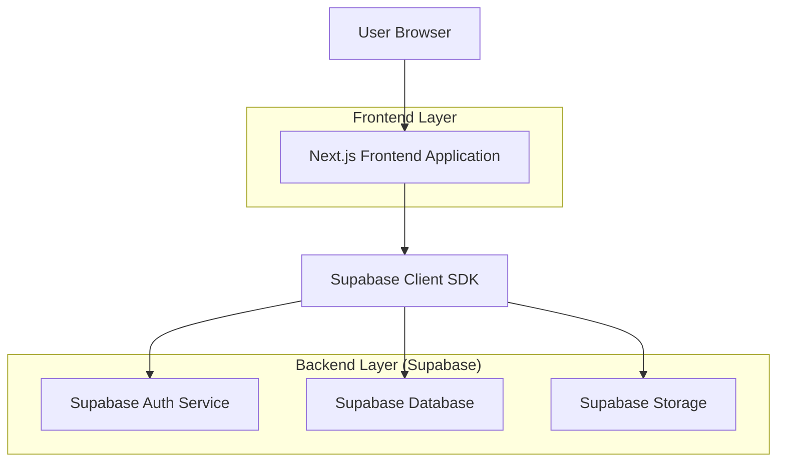
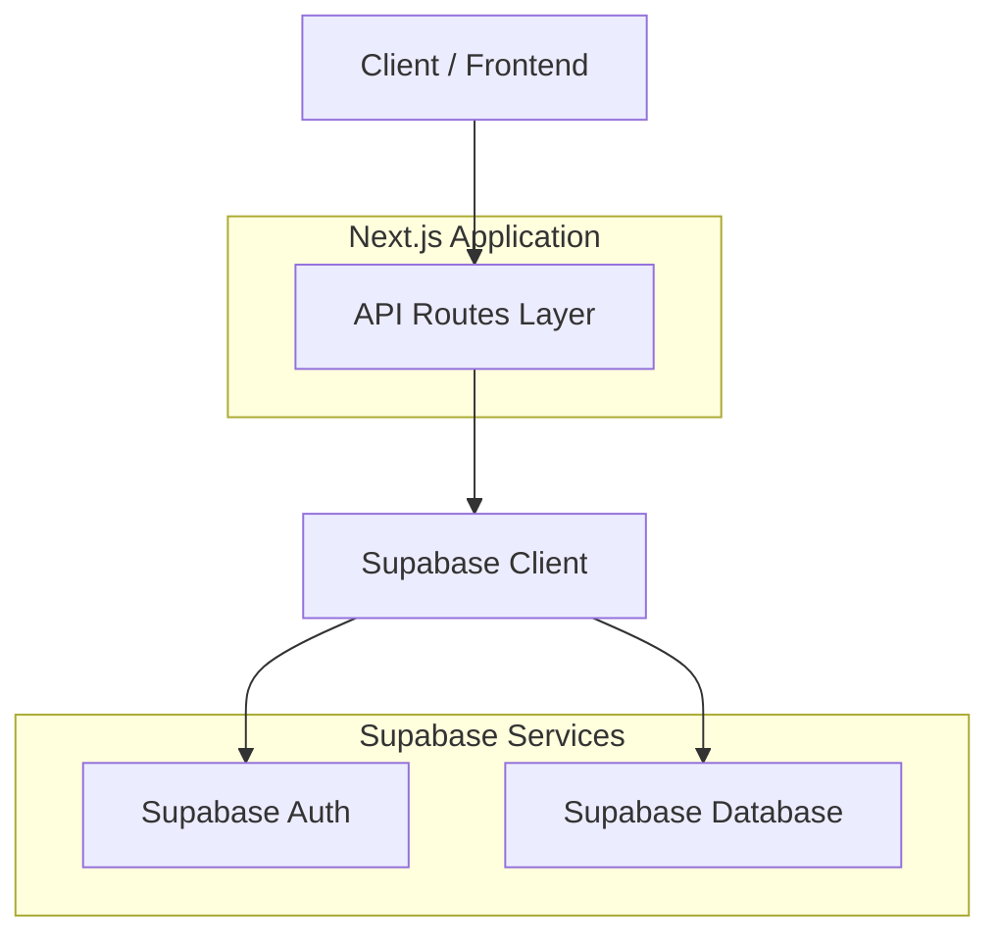
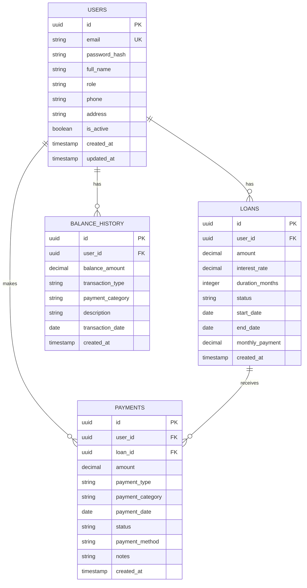

## 1. Architecture design



## 2. Technology Description

* **Frontend**: Next.js\@14 + React\@18 + TypeScript\@5

* **Styling**: TailwindCSS\@3 + HeadlessUI

* **Charts**: Recharts\@2

* **Database**: Supabase (PostgreSQL)

* **Authentication**: Supabase Auth

* **State Management**: React Context + SWR untuk data fetching

* **Initialization Tool**: create-next-app

## 3. Route definitions

| Route      | Purpose                                             |
| ---------- | --------------------------------------------------- |
| /          | Halaman utama (Home) - dashboard publik tanpa login |
| /login     | Halaman autentikasi khusus untuk pengurus           |
| /dashboard | Dashboard admin untuk pengurus yang sudah login     |
| /profile   | Halaman profil pengguna (opsional untuk anggota)    |
| /settings  | Pengaturan akun dan preferensi                      |

## 4. API definitions

### 4.1 Authentication API

**Login Pengurus**

```
POST /api/auth/login
```

Request:

| Param Name | Param Type | isRequired | Description       |
| ---------- | ---------- | ---------- | ----------------- |
| email      | string     | true       | Email pengurus    |
| password   | string     | true       | Password pengurus |

Response:

| Param Name | Param Type | Description                       |
| ---------- | ---------- | --------------------------------- |
| user       | object     | Data pengurus yang login          |
| session    | object     | JWT token dan metadata            |
| role       | string     | Role pengurus (fixed: 'pengurus') |

Example:

```json
{
  "email": "user@koperasi.com",
  "password": "password123",
  "role": "pengurus"
}
```

### 4.2 Dashboard Data API

**Get Public Dashboard Statistics (No Auth Required)**

```
GET /api/dashboard/public-stats
```

Response:

| Param Name        | Param Type | Description                    |
| ----------------- | ---------- | ------------------------------ |
| total\_members    | number     | Total anggota aktif            |
| total\_loans      | number     | Total pinjaman aktif           |
| total\_balance    | number     | Total saldo koperasi           |
| monthly\_payments | object     | Statistik pembayaran bulan ini |

**Get Admin Dashboard Statistics (Auth Required)**

```
GET /api/dashboard/admin-stats
```

Headers:

```
Authorization: Bearer {jwt_token}
```

Response:

| Param Name        | Param Type | Description                    |
| ----------------- | ---------- | ------------------------------ |
| total\_members    | number     | Total anggota aktif            |
| total\_loans      | number     | Total pinjaman aktif           |
| total\_balance    | number     | Total saldo koperasi           |
| monthly\_payments | object     | Statistik pembayaran bulan ini |

**Get Public Balance Chart Data (No Auth Required)**

```
GET /api/dashboard/public-balance-chart?year={year}&month={month}
```

Query Parameters:

| Param Name | Param Type | isRequired | Description                                |
| ---------- | ---------- | ---------- | ------------------------------------------ |
| year       | number     | false      | Tahun untuk filter (default: current year) |
| month      | number     | false      | Bulan untuk filter (default: all months)   |

### 4.3 Payment Management API

**Create Payment (including Infaq & Tabungan)**

```
POST /api/payments/create
```

Headers:

```
Authorization: Bearer {jwt_token}
```

Request:

| Param Name        | Param Type | isRequired | Description                                                  |
| ----------------- | ---------- | ---------- | ------------------------------------------------------------ |
| user\_id          | string     | true       | ID anggota yang melakukan pembayaran                         |
| amount            | number     | true       | Jumlah pembayaran                                            |
| payment\_category | string     | true       | Kategori: 'wajib', 'infaq', 'tabungan'                       |
| payment\_type     | string     | false      | Tipe pembayaran untuk pinjaman: 'monthly', 'partial', 'full' |
| loan\_id          | string     | false      | ID pinjaman (wajib jika payment\_category = 'wajib')         |
| payment\_method   | string     | false      | Metode pembayaran: 'cash', 'transfer'                        |
| notes             | string     | false      | Catatan tambahan                                             |
| payment\_date     | string     | false      | Tanggal pembayaran (default: today)                          |

**Get Optional Payment Statistics**

```
GET /api/payments/optional-stats?month={month}&year={year}
```

Query Parameters:

| Param Name | Param Type | isRequired | Description                    |
| ---------- | ---------- | ---------- | ------------------------------ |
| month      | number     | false      | Bulan (default: current month) |
| year       | number     | false      | Tahun (default: current year)  |

Response:

| Param Name       | Param Type | Description                        |
| ---------------- | ---------- | ---------------------------------- |
| total\_infaq     | number     | Total infaq bulan ini              |
| total\_tabungan  | number     | Total tabungan bulan ini           |
| infaq\_payers    | number     | Jumlah anggota yang bayar infaq    |
| tabungan\_payers | number     | Jumlah anggota yang bayar tabungan |
| infaq\_list      | array      | Daftar anggota yang bayar infaq    |
| tabungan\_list   | array      | Daftar anggota yang bayar tabungan |

## 5. Server architecture diagram



## 6. Data model

### 6.1 Data model definition



### 6.2 Data Definition Language

**Users Table**

```sql
CREATE TABLE users (
  id UUID PRIMARY KEY DEFAULT gen_random_uuid(),
  email VARCHAR(255) UNIQUE NOT NULL,
  password_hash VARCHAR(255) NOT NULL,
  full_name VARCHAR(255) NOT NULL,
  role VARCHAR(20) CHECK (role IN ('anggota', 'pengurus')) DEFAULT 'anggota',
  phone VARCHAR(20),
  address TEXT,
  is_active BOOLEAN DEFAULT true,
  created_at TIMESTAMP WITH TIME ZONE DEFAULT NOW(),
  updated_at TIMESTAMP WITH TIME ZONE DEFAULT NOW()
);

-- Indexes
CREATE INDEX idx_users_email ON users(email);
CREATE INDEX idx_users_role ON users(role);
```

**Loans Table**

```sql
CREATE TABLE loans (
  id UUID PRIMARY KEY DEFAULT gen_random_uuid(),
  user_id UUID REFERENCES users(id) ON DELETE CASCADE,
  amount DECIMAL(15,2) NOT NULL,
  interest_rate DECIMAL(5,2) DEFAULT 0,
  duration_months INTEGER NOT NULL,
  status VARCHAR(20) CHECK (status IN ('active', 'paid', 'overdue', 'cancelled')) DEFAULT 'active',
  start_date DATE NOT NULL,
  end_date DATE NOT NULL,
  monthly_payment DECIMAL(15,2) NOT NULL,
  created_at TIMESTAMP WITH TIME ZONE DEFAULT NOW()
);

-- Indexes
CREATE INDEX idx_loans_user_id ON loans(user_id);
CREATE INDEX idx_loans_status ON loans(status);
```

**Payments Table**

```sql
CREATE TABLE payments (
  id UUID PRIMARY KEY DEFAULT gen_random_uuid(),
  user_id UUID REFERENCES users(id) ON DELETE CASCADE,
  loan_id UUID REFERENCES loans(id) ON DELETE CASCADE,
  amount DECIMAL(15,2) NOT NULL,
  payment_type VARCHAR(20) CHECK (payment_type IN ('monthly', 'partial', 'full')),
  payment_category VARCHAR(20) CHECK (payment_category IN ('wajib', 'infaq', 'tabungan')) DEFAULT 'wajib',
  payment_date DATE NOT NULL,
  status VARCHAR(20) CHECK (status IN ('pending', 'completed', 'failed')) DEFAULT 'pending',
  payment_method VARCHAR(50),
  notes TEXT,
  created_at TIMESTAMP WITH TIME ZONE DEFAULT NOW()
);

-- Indexes
CREATE INDEX idx_payments_user_id ON payments(user_id);
CREATE INDEX idx_payments_loan_id ON payments(loan_id);
CREATE INDEX idx_payments_date ON payments(payment_date);
CREATE INDEX idx_payments_category ON payments(payment_category);
```

**Balance History Table**

```sql
CREATE TABLE balance_history (
  id UUID PRIMARY KEY DEFAULT gen_random_uuid(),
  user_id UUID REFERENCES users(id) ON DELETE CASCADE,
  balance_amount DECIMAL(15,2) NOT NULL,
  transaction_type VARCHAR(20) CHECK (transaction_type IN ('deposit', 'withdrawal', 'loan_payment', 'interest', 'infaq', 'tabungan')),
  payment_category VARCHAR(20) CHECK (payment_category IN ('wajib', 'infaq', 'tabungan')),
  description TEXT,
  transaction_date DATE NOT NULL,
  created_at TIMESTAMP WITH TIME ZONE DEFAULT NOW()
);

-- Indexes
CREATE INDEX idx_balance_user_id ON balance_history(user_id);
CREATE INDEX idx_balance_date ON balance_history(transaction_date);
CREATE INDEX idx_balance_category ON balance_history(payment_category);
```

**Row Level Security (RLS) Policies**

```sql
-- Enable RLS
ALTER TABLE users ENABLE ROW LEVEL SECURITY;
ALTER TABLE loans ENABLE ROW LEVEL SECURITY;
ALTER TABLE payments ENABLE ROW LEVEL SECURITY;
ALTER TABLE balance_history ENABLE ROW LEVEL SECURITY;

-- Grant public read access untuk data umum
GRANT SELECT ON users TO anon;
GRANT SELECT ON loans TO anon;
GRANT SELECT ON payments TO anon;
GRANT SELECT ON balance_history TO anon;

-- Users policies - Public read untuk data umum
CREATE POLICY "Public can view basic user data" ON users
  FOR SELECT USING (is_active = true);

CREATE POLICY "Users can view their own data" ON users
  FOR SELECT USING (auth.uid() = id);

CREATE POLICY "Pengurus can view all users" ON users
  FOR SELECT USING (EXISTS (
    SELECT 1 FROM users WHERE id = auth.uid() AND role = 'pengurus'
  ));

-- Loans policies - Public read untuk data umum
CREATE POLICY "Public can view active loans summary" ON loans
  FOR SELECT USING (status = 'active');

CREATE POLICY "Users can view their own loans" ON loans
  FOR SELECT USING (auth.uid() = user_id);

CREATE POLICY "Pengurus can manage all loans" ON loans
  FOR ALL USING (EXISTS (
    SELECT 1 FROM users WHERE id = auth.uid() AND role = 'pengurus'
  ));
```

